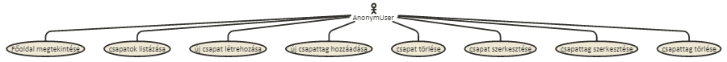
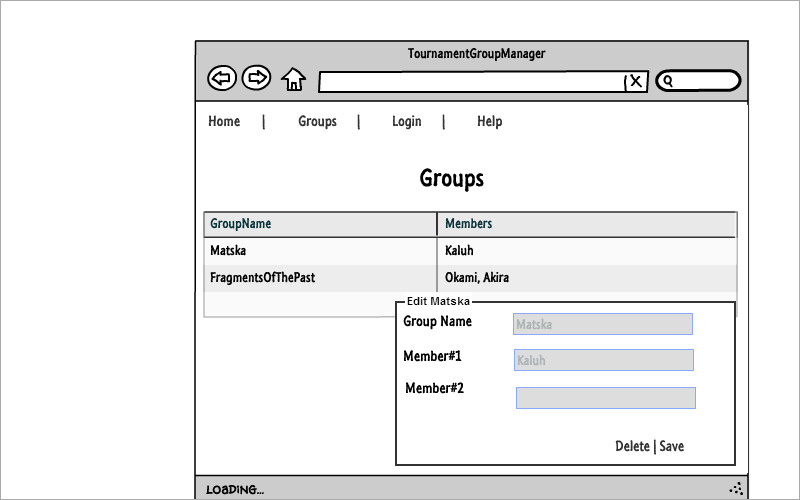
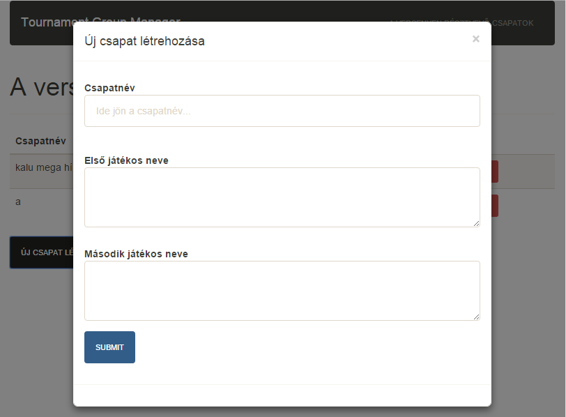
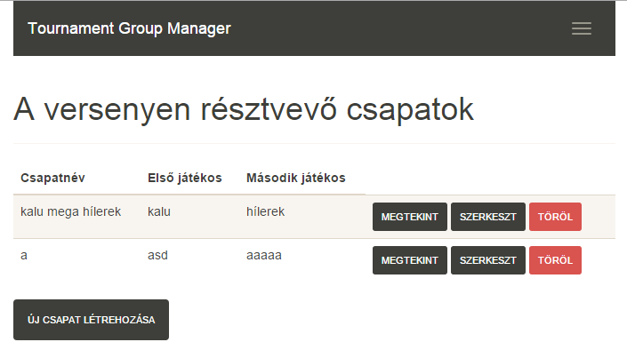
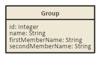
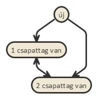

# TournamentGroupManager
Alkalmazások fejlesztése 1. Beadandó

## Követelményanalízis

A követelmény feltárás során felmérik és összegyűjtik a megrendelt szoftverrel szemben támasztott felhasználói követelményeket, elemzik az alkalmazási szakterületet. Részei:

1. Követelmények összegyűjtése: a nyújtandó szolgáltatások ismertetése rövid, szöveges leírásként, sokszor felsorolásként jelenik meg.
 * Funkcionális elvárások:
    * lehessen új csapatot létrehozni
    * lehessen csapattagokat hozzáadni meglévő csapathoz
    * lehessen hitelesített felhasználónak meglévő csapatot törölni
    * lehessen hitelesített felhasználónak meglévő csapatból csapattagot törölni
    * lehessen hitelesített felhasználónak meglévő csapatot szerkeszteni
    * lehessen hitelesített felhasználónak meglévő csapatból csapattagot szerkeszteni
    * lehessen listázni a meglévő csapatokat
 * Nem funkcionális követelmények
    * tartalmazzon két modellt, egy-sok kapcsolatban
    * REST API végpont kialakítása
    * szerveroldali perzisztálás fájlba
2. Szakterületi fogalomjegyzék: 
    * Csapat: egy vagy több tagból áll és névvel rendelkezik
    * Csapattag: névvel rendelkezik
3. Használatieset-modell
  * Szerepkörök: 
    * anonym user, minden user
  * Használati eset diagramok:
  * 
  * Egy folyamat pontos menete:
    * csapat szerkesztése
    * lépések
      1. kiválasztja a csapatot szerkesztésre
      2. a rendszer megjeleníti a csapat szerkesztőfelületét
      3. módosíthatja a csapat nevét
      4. törölhet csapattagot
      5. szerkeszthet csapattagot
      6. a felhasználó megnyomja a mentés gombot
      7. a rendszer elmenti a változtatásokat

## Tervezés

### 1. Architektúra terv

  * komponensdiagram

#### Oldaltérkép

##### Anonym user

- Főoldal
- Csapatok listája
    + új csapat
    + csapat szerkesztése
      * csapattag hozzáadása
      * csapattag törlése
    + csapat törlése
  
#### Végpontok

  * GET /: főoldal
  * GET /groups/list: csapatok listája
  * GET /groups/new: új csapat felvitele oldal
  * POST /groups/new: új csapat felvitele, adatok küldése
  * GET /groups/:id: csapat adatai
  * POST /groups/:id/edit: csapat szerkesztése
  * DELETE /groups/:id: csapat törlése

### 2. Felhasználóifelület-modell
  * Oldalvázlatok
    * 
  * Designterv
    * 
    * 
    * 
    * 

### 3. Osztálymodell
  * Adatmodell
  * 
  * Adatbázisterv
  * 
  * Állapotdiagram
  * 

### 4. Dinamikus működés
  * Szekvenciadiagram

## Implementáció

1. Fejlesztői környezet bemutatása
  * Cloud9, Github
2. Könyvtárstruktúra
  * `app/pods` - MVC rétegek tartalma pod-okba szervezve
  * `config` - konfiguráció
  * `documents` - _nomnoml_ diagrammok forráskódja
  * `images` - dokumentációban használt képek

## Tesztelés

### Tesztelési környezet

Az egységtesztelés _cloud9_ környezetben futtatva, kézzel történt.

### Tesztesetek

#### Új csapat felvitele

index / csapatok / új csapat felvitele : név, 1, 2 / submit

## Felhasználói dokumentáció

### A futtatáshoz ajánlott konfiguráció

#### Vastagkliens

* hardver: 500 MB memória, 5000 MB merevlemez
* szoftver: _Cloud9_

#### REST API

* hardver: 200 MB memória, 5000 MB merevlemez
* szoftver: _Cloud9_